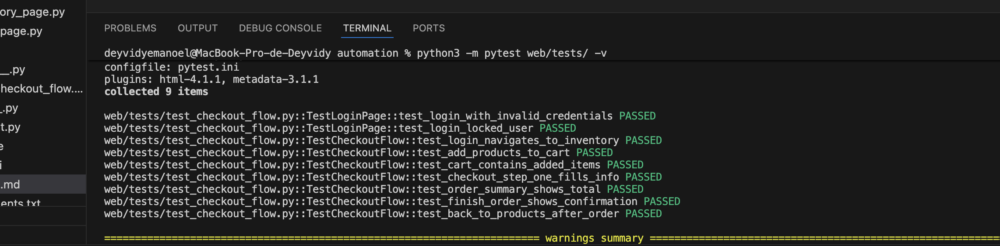

# Test Automation Suite

Projeto de automação de testes cobrindo API REST e fluxo E2E Web, com integração contínua via GitHub Actions.

---

## Tecnologias

| Camada | Tecnologia |
|--------|-----------|
| Linguagem | Python 3.12 |
| Framework de testes | pytest 8.2 |
| Automação de API | requests |
| Automação Web | Selenium 4 + WebDriver Manager |
| CI/CD | GitHub Actions |

---

## Estrutura do Projeto

```
automation/
├── api/
│   ├── utils/
│   │   └── api_client.py       # Cliente HTTP reutilizável
│   ├── tests/
│   │   ├── test_pet.py         # Endpoints de Pet (CRUD + findByStatus)
│   │   ├── test_store.py       # Endpoints de Store (inventário + pedidos)
│   │   └── test_user.py        # Endpoints de User (CRUD + login)
│   └── conftest.py
├── web/
│   ├── pages/                  # Page Objects
│   │   ├── base_page.py
│   │   ├── login_page.py
│   │   ├── inventory_page.py
│   │   ├── cart_page.py
│   │   ├── checkout_step_one_page.py
│   │   ├── checkout_step_two_page.py
│   │   └── checkout_complete_page.py
│   ├── tests/
│   │   └── test_checkout_flow.py   # Fluxo E2E completo
│   └── conftest.py
├── .github/
│   └── workflows/
│       ├── api-tests.yml
│       └── web-tests.yml
├── requirements.txt
└── pytest.ini
```

---

## Pré-requisitos

- Python 3.12+
- Google Chrome instalado (para testes web locais)

---

## Instalação

```bash
git clone <url-do-repositorio>
cd automation
pip install -r requirements.txt
```

---

## Execução

### Todos os testes
```bash
pytest
```

### Apenas testes de API
```bash
pytest api/tests/ -v
```

### Apenas testes Web
```bash
pytest web/tests/ -v
```

### Por marcador
```bash
pytest -m api     # somente API
pytest -m web     # somente Web
```

---

## Cobertura dos Testes

### API — Swagger Petstore (`https://petstore.swagger.io/v2`)

| Recurso | Operações cobertas |
|---------|-------------------|
| **Pet** | Criar, Buscar por ID, Atualizar, Buscar por status, Deletar |
| **Store** | Inventário, Criar pedido, Buscar pedido, Deletar pedido |
| **User** | Criar, Login, Buscar, Atualizar, Deletar |

### Web — SauceDemo (`https://www.saucedemo.com`)

| Cenário | Descrição |
|---------|-----------|
| Login inválido | Valida mensagem de erro com credenciais incorretas |
| Usuário bloqueado | Valida mensagem para `locked_out_user` |
| Fluxo E2E completo | Login → adicionar 2 produtos → carrinho → checkout → confirmação |

---

## CI/CD — GitHub Actions

Dois workflows independentes são disparados em todo `push` e `pull_request` para a branch `main`:

- **`api-tests.yml`** — executa `pytest api/tests/`
- **`web-tests.yml`** — executa `pytest web/tests/` com Chrome headless

Os relatórios JUnit XML são publicados como artefatos de cada execução.

---

## Design Patterns

- **Page Object Model (POM):** cada página do SauceDemo tem sua própria classe com locators e ações encapsulados.
- **Base Page:** classe pai com métodos genéricos (`find`, `click`, `type`) usando `WebDriverWait`.
- **Fixtures com escopo:** o `driver` tem escopo `session` (uma instância para todos os testes web); fixtures de API têm escopo `module` com cleanup automático.

---

## Prints

> Execute os testes localmente e adicione os prints das execuções abaixo.

| Execução | Print |
|----------|-------|
| API Tests (local) | `reports/api-results.xml` |
| Web Tests (local) | `reports/web-results.xml` |
| GitHub Actions — API | *(adicionar screenshot da aba Actions)* |
| GitHub Actions — Web | *(adicionar screenshot da aba Actions)* |
## Resultado dos Testes

